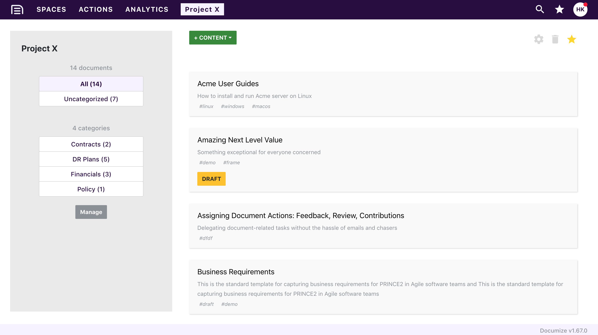

> We provide frequent product releases ensuring self-host customers enjoy the same features as our cloud/SaaS customers.
>
> Harvey Kandola, CEO & Founder, Documize Inc.

## The mission

To bring software development inspired features to the world of documenting -- refactoring, importing, testing, linting, metrics, PRs, versioning....

## What is it?

Documize is an intelligent document environment (IDE) for authoring, tracking and delivering documentation -- everything you need in one place.

## Why should I care?

Because maybe like us you're tired of:

* juggling WYSIWYG editors, wiki software and other document related solutions
* playing email tennis with documents, contributions, versions and feedback
* sharing not-so-secure folders with external participants

Sound familiar? Read on.

## Who is it for?

Anyone who wants a single place for any kind of document.

Anyone who wants to loop in external participants with complete security.

Anyone who wishes documentation and knowledge capture worked like agile software development.

Anyone who knows that nested folders fail miserably.

Anyone who wants to move on from wiki software.

## What's different about Documize?

Sane organization through personal, team and public spaces.

Granular document access control via categories.

Section based approach to document construction.

Reusable templates and content blocks.

Documentation related tasking and delegation.

Integrations for embedding SaaS data within documents, zero add-on/marketplace fees.

## What does it look like?

All spaces.

Space view.

## Latest version

[Community edition: v1.73.1](https://github.com/documize/community/releases)

[Enterprise edition: v1.75.1](https://documize.com/downloads)

## OS support

Documize can be installed and run on:

- Linux
- Windows
- macOS

Heck, Documize will probably run just fine on a Raspberry Pi 3.

## Database support

Documize supports the following database systems:

- PostgreSQL (v9.6+)
- MySQL (v5.7.10+ and v8.0.12+)
- Percona (v5.7.16-10+)
- MariaDB (10.3.0+)

Coming soon: Microsoft SQL Server 2017 (Linux/Windows).

## Browser support

Documize supports the following (evergreen) browsers:

- Chrome
- Firefox
- Safari
- Brave
- Vivaldi
- Opera
- MS Edge (16+)

## Technology stack

Documize is built with the following technologies:

- EmberJS (v3.1.2)
- Go (v1.11.2)

## Authentication options

Besides email/password login, you can also leverage the following options.

### LDAP / Active Directory

Connect and sync Documize with any LDAP v3 compliant provider including Microsoft Active Directory.

### Keycloak Integration

Documize provides out-of-the-box integration with [Redhat Keycloak](http://www.keycloak.org) for open source identity and access management.

Connect and authenticate with LDAP, Active Directory or leverage Social Login.

<https://docs.documize.com>

### Auth0 Compatible

Documize is compatible with Auth0 identity as a service.

Open Source Identity and Access Management

## Developer's Note

We try to follow sound advice when writing commit messages:

https://chris.beams.io/posts/git-commit/

## The legal bit

<https://documize.com>

This software (Documize Community Edition) is licensed under GNU AGPL v3 <http://www.gnu.org/licenses/agpl-3.0.en.html>. You can operate outside the AGPL restrictions by purchasing Documize Enterprise Edition and obtaining a commercial license by contacting <sales@documize.com>. Documize® is a registered trade mark of Documize Inc.
