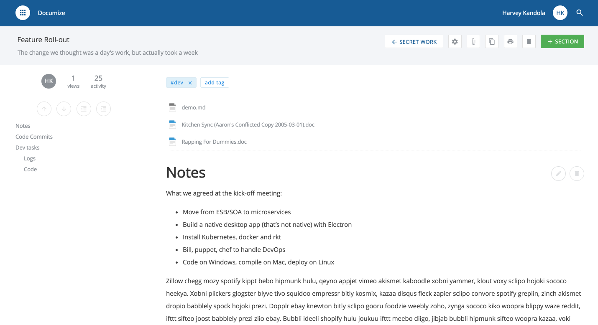

# Documize Community Edition

Documize is an Integrated Document Environment (IDE) unifying documents, wiki, reporting and dashboards -- one tool to power the enterprise-wide knowledge backbone.

The mission is to bring software dev inspired features (refactoring, testing, linting, metrics, PRs) to those poor souls stuck writing docs in the dark ages.

## Latest version

v1.52.2

## OS Support

- Windows
- Linux
- macOS

## Tech stack

- EmberJS (v2.14.0)
- Go (v1.8.3)
- MySQL (v5.7.10+) or Percona (v5.7.16-10+) or MariaDB (10.3.0+)

## Documentation

<https://docs.documize.com>

## Keycloak Integration

Documize provides out-of-the-box integration with [Redhat Keycloak](http://www.keycloak.org) for open source identity and access management.

Connect and authenticate with LDAP, Active Directory and more.

<https://docs.documize.com>

## Auth0 Compatible

Documize is compatible with Auth0 identity as a service.

Open Source Identity and Access Management

## Legal

<https://documize.com>

This software (Documize Community Edition) is licensed under GNU AGPL v3 <http://www.gnu.org/licenses/agpl-3.0.en.html>. You can operate outside the AGPL restrictions by purchasing Documize Enterprise Edition and obtaining a commercial license by contacting <sales@documize.com>. Documize® is a registered trade mark of Documize Inc.
