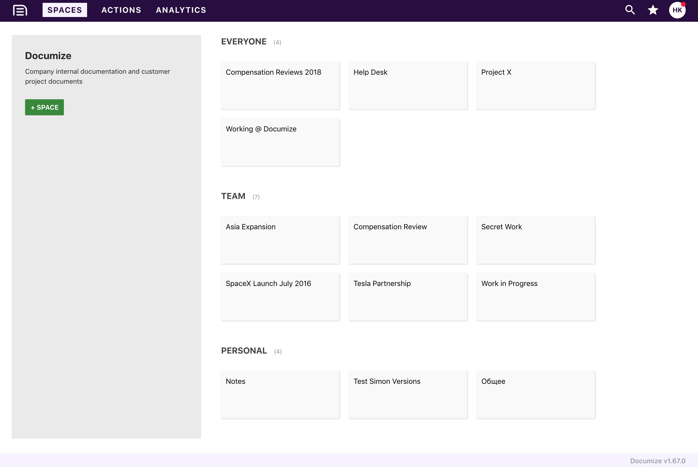

Documize is an open source modern, lightweight and comprehensive alternative to Confluence.

It's built with Golang + EmberJS and compiled down to a single executable binary for Linux, Windows and macOS.

All you need to provide is PostgreSQL, Microsoft SQL Server or any MySQL variant.

- Built for technical and non-technical users
- Designed to unify both customer-facing and internal documentation
- Organization through labels, spaces and categories
- No fee-charging marketplace

## Latest Release

[Community Edition: v3.0.0](https://github.com/documize/community/releases)

[Enterprise Edition: v3.0.0](https://www.documize.com/downloads)

> *We provide frequent product updates for both cloud and self-hosted customers.*
>
> **Harvey Kandola, CEO/Founder @ Documize**

## OS Support

- Linux
- Windows
- macOS
- Raspberry Pi (using the ARM builds)

## Database Support

- PostgreSQL (v9.6+)
- Microsoft SQL Server (2016+)
- MySQL (v5.7.10+ and v8.0.12+)
- Percona (v5.7.16-10+)
- MariaDB (10.3.0+)

## Browser Support

- Chrome
- Firefox
- Safari
- Brave
- Vivaldi
- Opera
- Microsoft Edge (v42+)

## Technology Stack

- Go (v1.12.5)
- Ember JS (v3.10.0)

## Authentication Options

Besides email/password login, you can also connect to LDAP/Active Directory or Red Hat Keycloak server.

Dual authentication of LDAP and email/password is also supported.

## The Legal Bit

<https://documize.com>

This software (Documize Community Edition) is licensed under GNU AGPL v3 <http://www.gnu.org/licenses/agpl-3.0.en.html>. You can operate outside the AGPL restrictions by purchasing Documize Enterprise Edition and obtaining a commercial license by contacting <sales@documize.com>. Documize® is a registered trade mark of Documize Inc.

Documize uses other open source components and we acknowledge them in [NOTICES](NOTICES.md)
