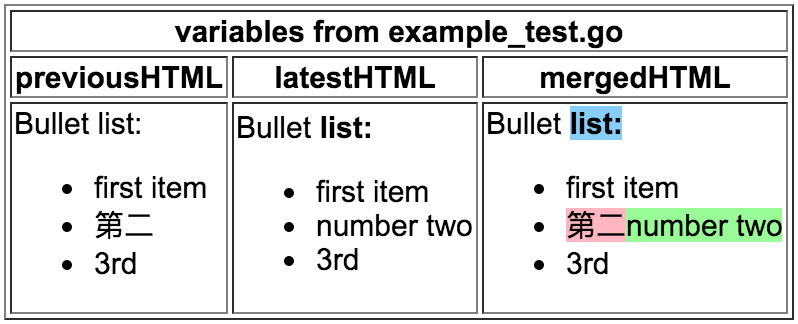

# html-diff

Calculate difference between two HTML snippets and return those differences as a merged HTML snippet showing the changes.

Usage:
```
	var cfg = &htmldiff.Config{
		Granularity:  5,
		InsertedSpan: []htmldiff.Attribute{{Key: "style", Val: "background-color: palegreen;"}},
		DeletedSpan:  []htmldiff.Attribute{{Key: "style", Val: "background-color: lightpink;"}},
		ReplacedSpan: []htmldiff.Attribute{{Key: "style", Val: "background-color: lightskyblue;"}},
		CleanTags:    []string{""},
	}
	res, err := cfg.HTMLdiff([]string{previousHTML, latestHTML})
	mergedHTML := res[0]
```


Only deals with body HTML, so no headers, only what is within the body element.

Requires Go1.5+, with vendoring support. Vendors "github.com/mb0/diff", "golang.org/x/net/html" and "golang.org/x/net/html/atom".

Running the tests will create output files in testout/*.html.

For fuzz-testing using https://github.com/dvyukov/go-fuzz , the Fuzz() function is in fuzz.go (as at Feb'16 you need to rename the ```vendor``` directory while you fuzz, and go get the dependencies - an issue with "go/importer", see https://github.com/golang/go/issues/13756).

Pull requests welcome.
